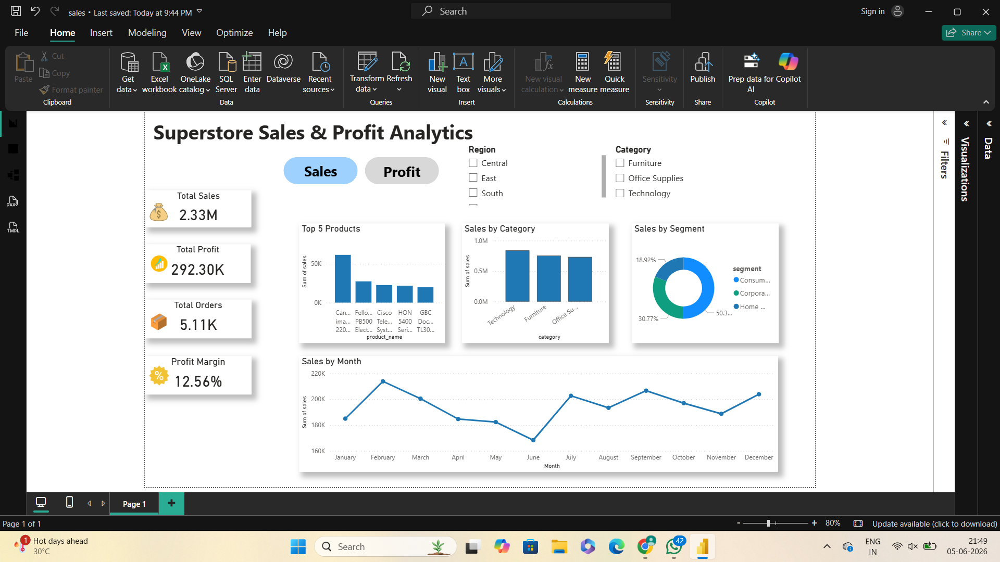
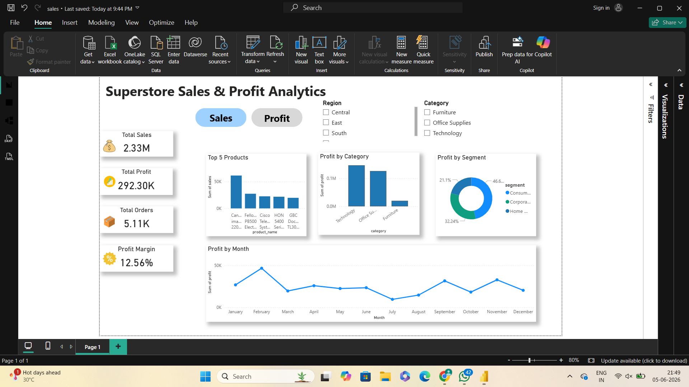

# Sales & Profit Analytics Dashboard (Power BI)

## Project Overview

This project is an interactive Sales and Profit Analytics Dashboard built using Power BI and the Superstore dataset.

The dashboard helps analyze sales performance, profitability, customer segments, product categories, and monthly trends through interactive visualizations and dynamic navigation.

---

## Dashboard Features

- Sales Dashboard
- Profit Dashboard
- Interactive Bookmarks & Navigation Buttons
- Region Filter
- Category Filter
- KPI Cards
- Profit Margin Calculation using DAX
- Monthly Trend Analysis
- Category Performance Analysis
- Segment Analysis
- Top Products Analysis

---

## KPIs

- Total Sales
- Total Profit
- Total Orders
- Profit Margin %

---

## Tools Used

- Power BI
- DAX
- Data Modeling
- Data Visualization
- GitHub

---

## DAX Measure

```DAX
Profit Margin % =
DIVIDE(
    SUM(sample_superstore[profit]),
    SUM(sample_superstore[sales]),
    0
) 
```

## Key Insights

- Technology generates the highest sales.
- Consumer segment contributes the largest share of revenue.
- Profitability varies across product categories.
- Monthly sales and profit trends help identify peak business periods.

---

## Dashboard Screenshots

### Sales Dashboard



### Profit Dashboard



---

## Author

Harshita Patil

Aspiring Data Analyst | Power BI | SQL | Excel | Python
